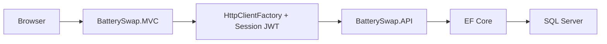

# Battery Swap Station Management System

[](https://dotnet.microsoft.com/)
[](https://learn.microsoft.com/aspnet/core/mvc/)
[](https://learn.microsoft.com/aspnet/core/web-api/)
[](https://www.microsoft.com/sql-server)
[](https://www.docker.com/)

University project for managing EV battery swap stations with an ASP.NET Core Web API backend, an ASP.NET Core MVC frontend, SQL Server persistence, and Docker-based deployment support.

## Table Of Contents

- [Overview](#overview)
- [Why This Project](#why-this-project)
- [Core Features](#core-features)
- [Feature Checklist](#feature-checklist)
- [Roles](#roles)
- [Business Rules](#business-rules)
- [Tech Stack](#tech-stack)
- [Architecture](#architecture)
- [Solution Structure](#solution-structure)
- [Main Modules](#main-modules)
- [API Summary](#api-summary)
- [Screenshots](#screenshots)
- [Local Development](#local-development)
- [Docker](#docker)
- [Demo Credentials](#demo-credentials)
- [Seeded Demo Data](#seeded-demo-data)
- [Recommended Demo Flow](#recommended-demo-flow)
- [Presentation Tips](#presentation-tips)
- [Documentation](#documentation)
- [Notes](#notes)

## Overview

This system is built for electric vehicle battery swapping operations such as rickshaws and bikes. Instead of waiting to charge a battery, a client visits a station, returns a depleted battery, receives an available charged battery, and is charged a fixed swap fee.

The project is split into three main parts:

- `BatterySwap.API` for business logic, authentication, and database access
- `BatterySwap.MVC` for the web interface and user workflows
- `BatterySwap.Shared` for shared constants and cross-project types

## Why This Project

This project is designed to demonstrate a complete university-grade software system rather than a single CRUD demo. It covers:

- real role-based workflows
- transactional business logic
- frontend and backend separation
- SQL-backed operational state
- reporting and presentation views
- local development plus Docker deployment support

## Core Features

- role-based authentication for `Admin` and `Employee`
- employee, client, station, and battery management
- client wallet recharge support
- atomic battery swap workflow
- dashboard with live KPI cards and charts
- station map with Leaflet
- swap and recharge history
- printable report summary page
- Swagger UI at the API root
- seeded demo data for fresh databases

## Feature Checklist

- [x] Admin login and session-based MVC authentication
- [x] Employee login and station-scoped workflows
- [x] Employee management
- [x] Client registration and maintenance
- [x] Station management
- [x] Battery management
- [x] Recharge workflow
- [x] Swap workflow with atomic updates
- [x] Swap history
- [x] Recharge history
- [x] Dashboard KPI and chart views
- [x] Station map with Leaflet
- [x] Printable reports
- [x] Swagger API documentation
- [x] Seeded demo data
- [x] Docker Compose support

## Roles

### Admin

- manages employees, clients, stations, and batteries
- views system-wide dashboard and reports
- recharges client accounts
- configures operational data

### Employee

- works from one assigned station
- registers clients
- recharges wallets
- processes swaps
- sees station-scoped operational views

### Client

- EV driver registered by Admin or Employee
- starts with `1000 Tk`
- pays `140 Tk` per battery swap

## Business Rules

- registration starts a client with `1000 Tk`
- each swap deducts exactly `140 Tk`
- swap only succeeds if the client has enough balance
- swap only succeeds if the station has an available battery
- returned battery and newly assigned battery are updated atomically
- one employee is assigned to at most one station
- a client holding a battery cannot be deactivated
- a battery currently with a client cannot be reassigned to a different station manually

## Tech Stack

### Backend

- ASP.NET Core 10 Web API
- C# 13
- Entity Framework Core 10
- SQL Server 2022
- JWT Bearer authentication
- Serilog
- FluentValidation
- BCrypt password hashing

### Frontend

- ASP.NET Core 10 MVC
- Razor views
- HttpClientFactory
- AdminLTE
- Bootstrap 5
- DataTables
- Chart.js
- Leaflet.js

### Dev and Deployment

- Docker Compose
- Dockerfiles for API and MVC
- local SQL Server or containerized SQL Server

## Architecture

The solution follows a three-tier structure:

- presentation layer: `BatterySwap.MVC`
- application layer: `BatterySwap.API`
- data layer: `SQL Server`

High-level request flow:



The MVC app does not access the database directly. All operational workflows go through the API.

## Solution Structure

```text
BatterySwap.slnx
BatterySwap.API/
BatterySwap.MVC/
BatterySwap.Shared/
docs/
scripts/
docker-compose.yml
```

## Main Modules

- authentication and role-based access
- employee management
- client management
- station management
- battery management
- wallet and recharge history
- swap processing
- dashboard and reporting
- map and station visibility

## API Summary

### Auth

- `POST /api/auth/login`

### Employees

- `GET /api/employees`
- `GET /api/employees/{id}`
- `POST /api/employees`
- `PUT /api/employees/{id}`
- `DELETE /api/employees/{id}`

### Clients

- `GET /api/clients`
- `GET /api/clients/{id}`
- `GET /api/clients/search?phone={phone}`
- `POST /api/clients`
- `PUT /api/clients/{id}`
- `DELETE /api/clients/{id}`
- `POST /api/clients/{id}/recharge`

### Stations

- `GET /api/stations`
- `GET /api/stations/{id}`
- `GET /api/stations/lookup`
- `POST /api/stations`
- `PUT /api/stations/{id}`

### Batteries

- `GET /api/batteries`
- `GET /api/batteries/{id}`
- `GET /api/batteries/available/{stationId}`
- `POST /api/batteries`
- `PUT /api/batteries/{id}`

### Swaps

- `GET /api/swaps`
- `GET /api/swaps/client/{clientId}`
- `POST /api/swaps`

### Recharges

- `GET /api/recharges`

### Dashboard and System

- `GET /api/dashboard/admin`
- `GET /api/dashboard/employee`
- `GET /health`
- `GET /api/system/info`

## Screenshots

You can add screenshots here later for GitHub presentation. Suggested images:

- `docs/screenshots/dashboard-admin.png`
- `docs/screenshots/client-profile.png`
- `docs/screenshots/swap-desk.png`
- `docs/screenshots/reports-summary.png`

Suggested section layout:

```md


```

## Local Development

### Prerequisites

- .NET 10 SDK
- SQL Server access
- database permissions for the configured connection

### Local Database

The development API is currently configured to use:

- SQL Server: `LAP031`
- database: `BatterySwapDB`
- authentication: Windows authentication

See:

- `BatterySwap.API/appsettings.Development.json`

### Run API

```powershell
dotnet run --project .\BatterySwap.API
```

Default local launch profile URLs:

- `http://localhost:5062`
- `https://localhost:7068`

Swagger opens from the API root.

### Run MVC

```powershell
dotnet run --project .\BatterySwap.MVC
```

Default local launch profile URLs:

- `http://localhost:5229`
- `https://localhost:7046`

### Quick Demo Scripts

```powershell
.\scripts\Start-Demo.ps1
.\scripts\Stop-Demo.ps1
```

### Recommended Local Start Order

1. Start `BatterySwap.API`
2. Confirm Swagger loads
3. Start `BatterySwap.MVC`
4. Login as Admin
5. Review the dashboard and modules
6. Logout and test the Employee flow

## Docker

Run the full stack with:

```powershell
docker compose up --build
```

Default Docker URLs:

- MVC: `http://localhost:8080`
- API Swagger: `http://localhost:8081`

Health endpoints:

- API: `/health`
- MVC: `/health`

## Demo Credentials

- Admin: `admin@batteryswap.local` / `Admin123!`
- Employee: `arif.h` / `Employee123!`
- Employee: `jerin.s` / `Employee123!`
- Employee: `farhan.a` / `Employee123!`

## Seeded Demo Data

On a fresh database, startup seeding creates:

- demo stations
- demo employees
- demo batteries
- demo clients
- recharge history
- swap history

The seeding is designed to be idempotent for core demo records and is applied during API startup.

## Recommended Demo Flow

### Admin flow

1. Login as Admin
2. Review Dashboard
3. Open Employees
4. Open Clients and inspect a client profile
5. Recharge a wallet
6. Review Stations and Batteries
7. Open Map
8. Open Histories
9. Open Reports

### Employee flow

1. Login as Employee
2. Review station-specific Dashboard
3. Open Swap Desk
4. Search a client by phone
5. Complete a swap
6. Review station-scoped history

## Presentation Tips

If you are presenting this project in class, viva, or a supervisor review, this order works well:

1. Start with the architecture: MVC, API, and SQL Server
2. Show Swagger to prove the backend is real and structured
3. Login as Admin and show dashboard, clients, stations, batteries, and reports
4. Login as Employee and show the swap desk
5. Emphasize that swap processing is atomic and role-aware
6. End with the printable report page

Good talking points:

- the MVC app never talks to the database directly
- the API enforces role-based restrictions
- balances and battery assignments are updated together in the swap transaction
- the project includes both operational workflows and reporting views

## Documentation

- main specification: `docs/ProjectSpecification.md`
- architecture overview: `docs/Architecture.md`
- demo walkthrough: `docs/DemoGuide.md`
- mac setup guide: `docs/MacSetup.md`

## Notes

- the repository is prepared for both local `dotnet run` usage and Docker usage
- the MVC app stores the JWT in server-side session and forwards it to the API
- the API root serves Swagger UI for easier inspection during development and demo
