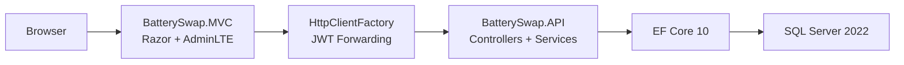
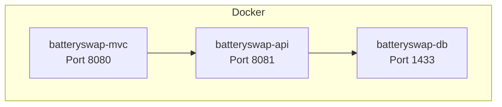

# Architecture Overview

## Three-Tier Structure

- `BatterySwap.MVC` is the presentation layer.
- `BatterySwap.API` is the application and business logic layer.
- `SQL Server` is the persistence layer.

The MVC app does not talk to the database directly. All business operations pass through the API.

## Request Flow

## Main Runtime Components

- `AccountController` signs users in through the API and stores JWT/session state.
- `BatterySwapApiService` acts as the MVC-side gateway for API communication.
- `SwapService` handles atomic battery swap processing.
- `WalletService` handles balance recharge transactions.
- `AppInitializer` applies migrations and seeds demo data on startup.

## Security Model

- API authentication uses `JWT Bearer`.
- MVC keeps the JWT inside server-side session state.
- Role checks are enforced both in the API and in the MVC navigation/workflows.
- Employee users are restricted to their own station context for swap and operational views.

## Deployment Shape

## Demo Notes

- On a fresh database, startup seeding creates a realistic demo state.
- Swagger is exposed from the API root for quick backend inspection.
- MVC exposes `/health` and API exposes `/health` for environment checks and container health probes.
